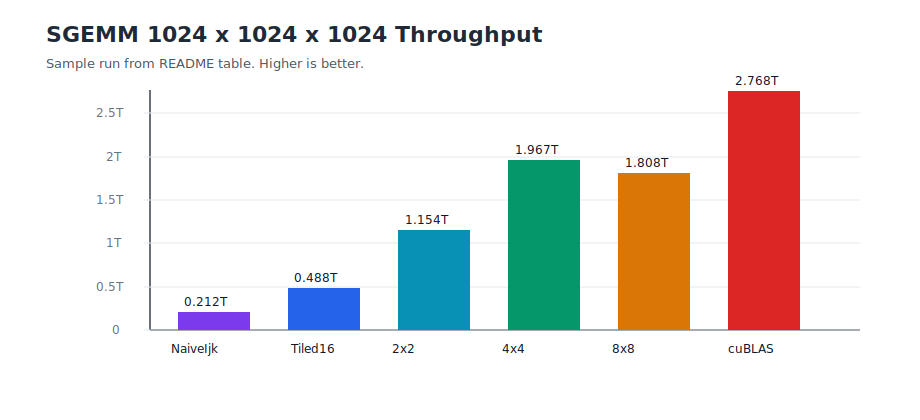

# CUDA GEMM Learning Workspace

This folder rebuilds row-major SGEMM on CUDA from a simple baseline toward
more efficient tiled kernels.

The current public implementations are:

```text
sgemm_ijk
sgemm_tiled_16
sgemm_tiled_16_2x2
sgemm_tiled_16_2x2_k32
sgemm_tiled_16_2x2_k64
sgemm_tiled_16_4x4
sgemm_tiled_16_4x4_k32
sgemm_tiled_16_4x4_k64
sgemm_tiled_16_8x8
sgemm_tiled_16_8x8_k32
sgemm_tiled_16_8x8_k64
```

The benchmark also includes cuBLAS as the reference performance ceiling.

## Contract

All kernels implement BLAS-style SGEMM:

```text
C = alpha * A * B + beta * C
```

The current scope is row-major, no-transpose:

```text
A: M x K
B: K x N
C: M x N
```

Elements are addressed as:

```cpp
A[row * lda + kk]
B[kk * ldb + col]
C[row * ldc + col]
```

For contiguous row-major matrices:

```text
lda = K
ldb = N
ldc = N
```

The API expects device pointers. Host allocation and host-device copies stay
outside the wrapper so tests, demos, and benchmarks can choose what to measure.

## Implementations

`sgemm_ijk` assigns one CUDA thread to one output element:

```cpp
for (int kk = 0; kk < K; ++kk) {
  sum += A[row * lda + kk] * B[kk * ldb + col];
}
C[row * ldc + col] = alpha * sum + beta * C[row * ldc + col];
```

This is intentionally naive:

- Each thread reads one row of `A` contiguously.
- Each thread reads one column of `B` with stride `ldb`.
- Neighboring threads reuse the same `A` values but reload them independently.
- There is no shared-memory tiling yet.

`sgemm_tiled_16` keeps one thread per output element, but stages one `16x16`
tile of `A` and one `16x16` tile of `B` through shared memory for each K chunk.
The `A` tile is stored transposed in shared memory as `tileA[k_local][row_local]`
so the compute loop reads the A operand with the transposed shared-memory index.

```text
threads/block: 16 x 16 = 256
C outputs/block: 16 x 16 = 256
shared memory: (16 x 16 + 16 x 16) floats = 2 KiB
```

The register-blocked variants keep the same `16x16` CUDA thread block, but each
thread computes a small square patch of `C` in registers:

```text
variant    C tile       shared A     shared B     shared memory    accumulators/thread
2x2        32 x 32      32 x 16      16 x 32      4 KiB            4
4x4        64 x 64      64 x 16      16 x 64      8 KiB            16
8x8        128 x 128    128 x 16     16 x 128     16 KiB           64
```

The tradeoff is arithmetic intensity versus resource pressure:

- `2x2` reuses each loaded `A` value across two output columns and each loaded
  `B` value across two output rows.
- `4x4` does more work per loaded shared tile and has been the peak variant in
  the current 1024 benchmark.
- `8x8` pushes register pressure and reduces the number of blocks for a fixed
  matrix. It is useful as a decay point.

The `2x2`, `4x4`, and `8x8` wrappers share one internal implementation:

```cpp
template <int Tile, int ThreadTile, int KTile>
cudaError_t sgemm_tiled_thread_tile_impl(...);
```

Conceptually, each block computes:

```text
OutputRows = Tile * ThreadTile
OutputCols = Tile * ThreadTile
KTile      = depth of one staged K slice
```

The current public wrappers use `Tile=16` and `KTile=16`:

```text
sgemm_tiled_16_2x2 -> sgemm_tiled_thread_tile_impl<16, 2, 16>
sgemm_tiled_16_4x4 -> sgemm_tiled_thread_tile_impl<16, 4, 16>
sgemm_tiled_16_8x8 -> sgemm_tiled_thread_tile_impl<16, 8, 16>
```

`KTile` is now the compile-time tuning knob for the K direction. For example,
`sgemm_tiled_thread_tile_impl<16, 4, 32>` would keep the `4x4` per-thread output
work but stage a `KTile=32` slice each iteration.

The K-tile variants use dynamic shared memory:

```text
variant    KTile=16    KTile=32    KTile=64
2x2        4 KiB       8 KiB       16 KiB
4x4        8 KiB       16 KiB      32 KiB
8x8        16 KiB      32 KiB      64 KiB
```

So `KTile=64` fits comfortably for `2x2` and `4x4`. For `8x8`, it needs 64 KiB
of shared memory per block. That is above the common 48 KiB default, so the
wrapper opts in with `cudaFuncSetAttribute`. It should run on GPUs with enough
per-block shared memory, but the wrapper can return an error on smaller devices.

## Planned Progression

1. `sgemm_ijk`: one thread per `C` element, direct global-memory reads.
2. `sgemm_tiled_16`: cooperative square shared-memory tiles of `A` and `B`.
3. `sgemm_tiled_16_2x2`: register blocking, four `C` elements per thread.
4. `sgemm_tiled_16_4x4`: register blocking, sixteen `C` elements per thread.
5. `sgemm_tiled_16_8x8`: register blocking, sixty-four `C` elements per thread.
6. `KTile=32` and `KTile=64`: fewer K-loop iterations with more shared memory.
7. Compare against cuBLAS for a performance ceiling.

## Benchmark

`PMPP_gemm_bench` compares one fixed moderate case:

```text
M = 1024
N = 1024
K = 1024
```

It runs:

```text
SGEMM/NaiveIjk/1024
SGEMM/Tiled16/1024
SGEMM/Tiled16_2x2/1024
SGEMM/Tiled16_4x4/1024
SGEMM/Tiled16_8x8/1024
SGEMM/Tiled16_2x2K32/1024
SGEMM/Tiled16_2x2K64/1024
SGEMM/Tiled16_4x4K32/1024
SGEMM/Tiled16_4x4K64/1024
SGEMM/Tiled16_8x8K32/1024
SGEMM/Tiled16_8x8K64/1024
SGEMM/cuBLAS/1024
```

The benchmark keeps matrices on the device and synchronizes after each call, so
the measurement excludes host allocation and host-device copies. The cuBLAS call
uses the row-major identity:

```text
C = A * B  <=>  C^T = B^T * A^T
```

Build and run the focused targets:

```bash
cmake --build release --target PMPP_gemm_test PMPP_gemm_bench
./release/cuda/PMPP/gemm/PMPP_gemm_test
./release/cuda/PMPP/gemm/PMPP_gemm_bench --benchmark_min_time=0.2s
```

## Example Result

The following sample is from a `1024 x 1024 x 1024` run on the non-H100 system
used during this learning pass. Hardware, clocks, CUDA version, and cuBLAS math
mode can change these numbers.

| Kernel | Time | Throughput |
| --- | ---: | ---: |
| `SGEMM/NaiveIjk/1024` | 10.1 ms | 212.131 GFLOP/s |
| `SGEMM/Tiled16/1024` | 4.40 ms | 488.035 GFLOP/s |
| `SGEMM/Tiled16_2x2/1024` | 1.86 ms | 1.15448 TFLOP/s |
| `SGEMM/Tiled16_4x4/1024` | 1.09 ms | 1.96688 TFLOP/s |
| `SGEMM/Tiled16_8x8/1024` | 1.19 ms | 1.80846 TFLOP/s |
| `SGEMM/cuBLAS/1024` | 0.776 ms | 2.76849 TFLOP/s |



From that sample:

```text
Tiled16 speedup over NaiveIjk: 10.1 / 4.40 = 2.30x
Tiled16_4x4 speedup over Tiled16: 4.40 / 1.09 = 4.04x
Tiled16_4x4 speedup over Tiled16_2x2: 1.86 / 1.09 = 1.71x
cuBLAS speedup over Tiled16_4x4: 1.09 / 0.776 = 1.40x
```

## Nsight Compute Profile Notes

`ncu_profile_analysis.md` walks through the exported Nsight Compute CSV reports
for the `2x2`, `4x4`, and `8x8` register-blocked kernels. It explains how to
read the main NCU sections and why the current `4x4` kernel is the best point
for the `1024 x 1024 x 1024` benchmark.

`profile_ncu.py` automates the same workflow for the current benchmark set:

```bash
python3 cuda/PMPP/gemm/profile_ncu.py
```

By default it profiles the custom tiled SGEMM variants with a focused NCU
section set, converts each `.ncu-rep` file to a details CSV, and writes:

```text
release/cuda/PMPP/gemm/ncu_profiles/summary.csv
release/cuda/PMPP/gemm/ncu_profiles/summary.md
```

Useful modes:

```bash
# Only summarize existing details CSVs.
python3 cuda/PMPP/gemm/profile_ncu.py --mode summarize \
  --csv release/cuda/PMPP/gemm/ncu_sgemm_2x2_details.csv --csv-label 2x2 \
  --csv release/cuda/PMPP/gemm/ncu_sgemm_4x4_details.csv --csv-label 4x4 \
  --csv release/cuda/PMPP/gemm/ncu_sgemm_8x8_details.csv --csv-label 8x8

# Profile one variant.
python3 cuda/PMPP/gemm/profile_ncu.py --variant 4x4K64
```

## CUTLASS Example

`cutlass_sgemm_example.cu` is a minimal row-major SGEMM example using
`cutlass::gemm::device::Gemm`. The source is intentionally commented around the
important CUTLASS concepts: layout selection, the GEMM type alias, `Arguments`,
`can_implement`, and the asynchronous launch call.

It computes:

```text
D = alpha * A * B + beta * C

A: 128 x 64 row-major
B: 64 x 96 row-major
C: 128 x 96 row-major
D: 128 x 96 row-major
```

The example mirrors the learning kernels in this folder by using row-major
inputs and explicit leading dimensions:

```cpp
using RowMajor = cutlass::layout::RowMajor;
using CutlassSgemm =
    cutlass::gemm::device::Gemm<float, RowMajor, float, RowMajor, float,
                                RowMajor, float>;

CutlassSgemm::Arguments args(
    {M, N, K},
    {d_A, K},
    {d_B, N},
    {d_C, N},
    {d_D, N},
    {alpha, beta});
```

CMake only builds the example when CUTLASS headers are available. You can point
`CUTLASS_ROOT` at an existing CUTLASS checkout:

```bash
cmake -S . -B release -DUSE_CUDA=ON -DCUTLASS_ROOT=/path/to/cutlass
cmake --build release --target PMPP_cutlass_sgemm_example
./release/cuda/PMPP/gemm/PMPP_cutlass_sgemm_example
```

Or let CMake download CUTLASS with `FetchContent`:

```bash
cmake -S . -B release -DUSE_CUDA=ON -DCXX_LEARNING_FETCH_CUTLASS=ON
cmake --build release --target PMPP_cutlass_sgemm_example
./release/cuda/PMPP/gemm/PMPP_cutlass_sgemm_example
```

The fetched version is controlled by:

```bash
-DCXX_LEARNING_CUTLASS_GIT_TAG=v4.3.4
```

Expected output shape:

```text
CUTLASS row-major SGEMM example
M=128 N=96 K=64
max_abs_error=<small number>
```
